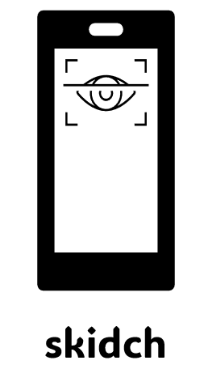

# skidch
### : 스마트폰을 사용하는 어린이들의 눈 보호를 위한 어플리케이션

  

  
<h2>목차</h2>
<ul>
    <li><a href="#기능설명">1. 기능 설명</a>
        <ul>
            <li><a href="#비밀번호-설정">1.1 비밀번호 설정</a></li>
            <li><a href="#시력보호-모드">1.2 시력 보호 모드</a></li>
            <li><a href="#보행-시-사용-금지모드">1.3 보행 시 사용 금지 모드</a></li>
        </ul>
    </li>
    <li><a href="#기술-스택">2. 기술 스택</a></li>
    <li><a href="#version">3. 버전 정보</a></li>
    <li><a href="#team">4. 팀 정보 (Team Information)</a></li>
</ul>

  

<h2 id="기능설명">기능 설명</h2>

<h3 id="비밀번호-설정">🤐비밀번호 설정🤐</h3>
_storage.write 메서드를 사용하여 Flutter Secure Storage에 비밀번호 저장. StatefulWidget으로 구현하여 사용자의 입력상태를 관리하고 GlobalKey<FormState>를 사용하여 폼의 상태를 추적하며 입력값의 유효성을 검사하도록 구현.

  

    

  

<h3 id="시력보호-모드">🦉시력 보호 모드🌙</h3>
안드로이드의 lightSensor 활용, flutter의 MethodChannel을 통해 애플리케이션과 네이티브 코드간의 원활한 통신을 지원했고 ForegroundService와 BackgroundService 이용하여 백그라운드에서도 동작이 가능하도록 설정하였다. 주변이 3초이상 어두워지게되면 어두운곳으로 이동한 것으로 판단해 화면이 잠기게 되며, 밝은곳으로 이동할 시 잠금이 풀리는 로직 구현

  

    

  

<h3 id="보행-시-사용-금지모드">🚶‍♂️보행 시 사용 금지 모드🚶‍♀️</h3>
안드로이드의 stepSensor 활용, flutter의 MethodChannel을 통해 애플리케이션과 네이티브 코드간의 원활한 통신을 지원했고 ForegroundService와 BackgroundService 이용하여 백그라운드에서도 동작이 가능하도록 설정. 사용자가 걷기 시작하면 화면 오버레이가 뜨며 화면을 방해하고, 2초이상 걸음이 감지되지 않을 시 오버레이를 숨기는 로직 구현

  

    

  

<h2 id="기술-스택">기술 스택</h2>
<ul>
    <li><strong>Frontend</strong>: Flutter(Dart), HTML</li>
    <li><strong>Backend</strong>: Java, C++</li>
    <li><strong>Tools</strong>: CMake</li>
</ul>
 

<h2 id="version">버전 정보</h2>
- **Android Studio**: 2022.3.1.22 (Giraffe Patch 4)
- **Flutter SDK**: >=3.1.5 <4.0.0
- **Flutter Secure Storage**: ^5.0.2
- **Java**: Java 8
- **Android Gradle Plugin**: 7.4.2
  
 

<h2 id="team">프로젝트 실행방법</h2>
### First. Install Android Studio
### Second. Open Project
### Third. pair using Wi-Fi and QR scan
### App run

 

<h1 id="team"> :family_man_man_girl_boy:팀 정보 (Team Information) </h1>
 

|  팀원  |     역할     |         Email         |
| :----: | :----------: | :-------------------: |
| 김보현 |  Full Stack  |  qhgus62@naver.com  |
| 전하영 |  Full Stack  |  wjsgkdd@gmail.com  |
| 조혜령 |      FE     |  sns220@naver.com  |

